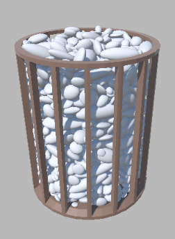
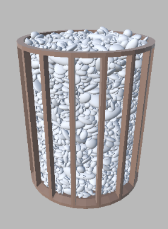
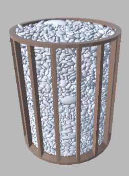

# Physically based mixing of gravel and its geometric parameters
### Diploma Thesis

#### Abstract
In this study, we investigate the properties of aggregates as a fundamental component incorporated in concrete.
Motivation for this research is to enhance characteristics of concrete. Our objective is to examine the relationships
between the geometric properties of aggregates, the ratio at which different  fractions are mixed, and the resulting 
porosity of the mixture. To achieve this goal, we construct a model of loose aggregate in a container using  simulation 
of physical principles  such as gravity and force interactions in the Unity game engine. For generating aggregate particles 
represented by ellipsoids, we employ the geometric characteristics of  fractions from a real aggregate sample.
To evaluate our approach, we create multiple models of mixtures containing various fractions mixed in different ratios
using our algorithm. We compare the resulting porosity of the models with the actual porosity established through
experimentation on real aggregates. The contribution of our work lies in a comprehensive methodology for generating data
that is labor-intensive to acquire in a real environment. Our tool enables the formulation of hypotheses about the porosity
of aggregate mixtures and their subsequent optimization.

#### This project

These files constitute a Unity project in which the stone mixing algorithm has been implemented, intended for generating models for a diploma thesis.

 

